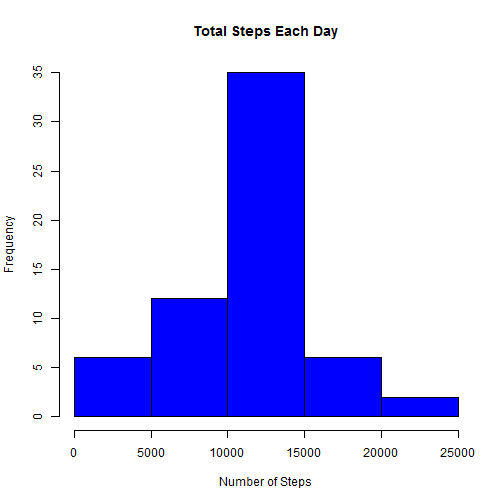

#Load & Pre-Process Data

1. Load the data
2. Process/transform the data (if necessary) into a format suitable for your analysis


```r
library(tidyverse)
dat <- read_csv("activity.csv")
```

```
## Parsed with column specification:
## cols(
##   steps = col_integer(),
##   date = col_date(format = ""),
##   interval = col_integer()
## )
```

```r
glimpse(dat)
```

```
## Observations: 17,568
## Variables: 3
## $ steps    <int> NA, NA, NA, NA, NA, NA, NA, NA, NA, NA, NA, NA, NA, N...
## $ date     <date> 2012-10-01, 2012-10-01, 2012-10-01, 2012-10-01, 2012...
## $ interval <int> 0, 5, 10, 15, 20, 25, 30, 35, 40, 45, 50, 55, 100, 10...
```

#Step Patterns

1. Calcualte the total number of steps taken per day
2. Make a histogram of the total number of steps taken per day
3. Calcaulate the mean and median of steps taken per day


```r
steps_by_day <- aggregate(steps ~ date, dat, sum)
hist(steps_by_day$steps, main = paste("Total Steps Each Day"), col="blue", xlab="Number of Steps")
```


```r
mean <- mean(steps_by_day$steps)
median <- median(steps_by_day$steps)
```
 - The mean is r rmean and the median is 10765.

#Daily Activity

1. Make a time series plot of the 5 minute intervals of average steps taken averaged accross all days 
2. White 5-minute interval, on average across all days, contains the maximum number of steps?
    It occurs around time interval 750


```r
int_steps <- dat %>% 
  group_by(interval) %>% 
  summarise(avg = mean(steps, na.rm = TRUE))

plot(int_steps$interval,int_steps$avg, type="l", xlab="Interval", ylab="Number of Steps",main="Average Number of Steps per Day by Interval")
```


```r
max_interval <- int_steps[which.max(int_steps$avg),1]
```

The 5-minute interval, on average across all the days in the data set, containing the maximum number of steps is 835.

#Impute Missing Values

1. Calculate the number of missing values
2. Devise a strategey for filling in the missing values in the dataset
    Fill in the missing value with the mean of the interval in which the data point is missing
3. Create a new dataset with the missing values filled in
4. Make a histogram of the total number of steps taken each day and report the mean/median of the total number of steps


```r
sum(is.na(dat))
```

```
## [1] 2304
```

```r
int_steps <- dat %>% 
  group_by(interval) %>% 
  summarise(avg = mean(steps, na.rm = TRUE))

data.i <- dat %>% 
  mutate(steps = ifelse(is.na(dat$steps), int_steps$avg[match(dat$interval,int_steps$interval)], dat$steps))

data.i[as.character(data.i$date) == "2012-10-01", 1] <- 0

int_steps.i <- data.i %>%
  group_by(date) %>% 
  summarise(total = sum(steps))

int_steps <- dat %>%
  group_by(date) %>% 
  summarise(total = sum(steps))

hist(int_steps.i$total, main = paste("Total Steps Each Day"), col="blue", xlab="Number of Steps")
```



```r
mean.i <- mean(int_steps.i$total)
median.i <- median(int_steps.i$total)


mean_diff <- mean(int_steps$total, na.rm = TRUE) - mean(int_steps.i$total)
med_diff <- median(int_steps$total, na.rm = TRUE) - median(int_steps.i$total)
total_diff <- sum(int_steps$total, na.rm = TRUE) - sum(int_steps.i$total)
```


- The imputed data mean is 1.0589694 &times; 10<sup>4</sup>
- The imputed data median is 1.0766189 &times; 10<sup>4</sup>
- The difference between the non-imputed mean and imputed mean is 176.4948964
- The difference between the non-imputed mean and imputed mean is -1.1886792
- The difference between total number of steps between imputed and non-imputed data is -7.5363321 &times; 10<sup>4</sup>. Thus, there were -7.5363321 &times; 10<sup>4</sup> more steps in the imputed data.


#Difference between Weekdays and Weekends

1. Create a factor variable in the dataset with 2 levels, weekday and weekend indicating the day of the week
2. Make a panel plot containing a time series plot by 5-minute interval of average number of steps taken across all weekday days and weekend days


```r
weekdays <- c("Monday", "Tuesday", "Wednesday", "Thursday", "Friday")
data.i$dow <-  as.factor(ifelse(is.element(weekdays(as.Date(data.i$date)),weekdays), "Weekday", "Weekend"))

int_steps.i <-  data.i %>% 
  group_by(interval, dow) %>% 
  summarise(avg = mean(steps))

library(lattice)

xyplot(int_steps.i$avg ~ int_steps.i$interval|int_steps.i$dow, main="Average Steps per Day by Interval",xlab="Interval", ylab="Steps",layout=c(1,2), type="l")
```


- Created a plot to compare and contrast number of steps between the week and weekend. There is a higher peak earlier on weekdays, and more overall activity on weekends.
